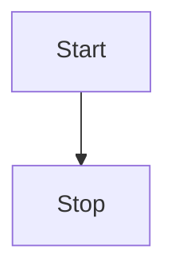

您可以使用 [Mermaid](https://mermaid.js.org) 在MDX文件中渲染图表和图解：

````txt {tabTitle:示例}

```mermaid
flowchart TD
  Start --> Stop
```
````

将变成这样：


```mermaid
flowchart TD
    Start --> Stop
```

请参阅 [Mermaid文档](https://mermaid.js.org/intro/) 了解可以渲染的图表和图解类型。